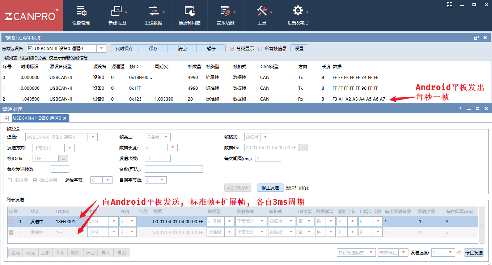

# Android_SocketCAN

在Android平板上使用SocketCAN

- [Android_SocketCAN](#android_socketcan)
  - [概要](#概要)
  - [adb 连接](#adb-连接)
  - [adb 常用操作](#adb-常用操作)
  - [CAN配置脚本](#can配置脚本)
  - [SocketCAN](#socketcan)
  - [JNI](#jni)
  - [JNI与SocketCAN](#jni与socketcan)
    - [Makefile](#makefile)
    - [jnican.java](#jnicanjava)
    - [生成的 jnican..h](#生成的-jnicanh)
    - [jnican.c](#jnicanc)
    - [运行](#运行)
    - [github jni can](#github-jni-can)
  - [NDK](#ndk)
  - [Android Studio](#android-studio)
  - [Android_SocketCAN 工程](#android_socketcan-工程)
  - [Apktool](#apktool)
  - [Github Android_SocketCAN](#github-android_socketcan)

## 概要

5年前的配置了:

- MSM8953(骁龙625, 14nm, 8*Coretex-A53, 64bit, ARMv8-A, 2016年), 2+16GB
- Android 7.1.x, Linux内核是3.18.x
- 屏幕分辨率是常见的 1280*800
- SOC没有CAN, 通过SPI外扩的两路CAN, MCP2515, 应用层上看还是SocketCAN. 这个Linux驱动其实挺不好整的, 特别是较老的内核和驱动, 连发丢帧的问题很明显

## adb 连接

操作:

- 设置->关于手机->连点5下版本号->返回到开发者选项->开启USB调试. (可能不需要这个步骤)
- 设置->更多->USB Host开关两次, 最后的状态是关

插拔USB, 就可以在 Win 的设备管理里面看到


然后就可以在 wsl2 或者 powershell 中操作了

```bash
# 配置环境变量就直接adb, 不配置就切换到adb目录, ./adb.exe
adb version
adb devices
adb logcat
adb shell

# 如果出现 more than one device/emulator 错误
# 如果只有一个模拟器和一个手机连着电脑:
# 可以用adb -e 来指明是操作模拟器 Emulator
# 可以用adb -d 来指明是操作设备 Device
adb -d shell
```

参考:

- [消除ADB错误“more than one device and emulator”的方法_杭州山不高的博客-CSDN博客](https://blog.csdn.net/gaojinshan/article/details/9455193)

## adb 常用操作

```bash
# 似乎默认没有文本编辑, 在shell中编辑文件显得困难
# 可以先拷出来, 编辑好后, 再推回去
adb root
adb remount
adb pull <android文件> <pc>
编辑...
adb push <pc文件> <android>

# 很多Linux命令是可以直接用的, 命令大都在 `/system/bin` 里面
# 因为很多权限没有, 索性直接root后再进shell
adb root
adb shell

# 查看内存
free -m

# 查看分区
df -H

# 打印内核信息
dmesg

# 查看网络信息
ifconfig

ping www.baidu.com
route -n

# 很多应用可以交叉编译或使用aarch64的, 放到 /system/bin 里面
```

## CAN配置脚本

注意用于Android平板时开头是 `#!/system/bin/sh`, 不是Ubuntu中的`#!/bin/bash`, 脚本开机启动

```bash
#!/system/bin/sh

sleep 10

ip link set down can0
ip link set can0 type can bitrate 500000 sample-point 0.875 restart-ms 100
ip link set up can0 mtu 16
ifconfig can0 txqueuelen 1000

ip link set down can1
ip link set can1 type can bitrate 500000 sample-point 0.875 restart-ms 100
ip link set up can1 mtu 16
ifconfig can1 txqueuelen 1000
```

这些命令固然可以在C中用system方式运行, 但不建议, 毕竟这个算是系统的, 类似于eth, 各个进程都能用, 也为了方便调试, 最好不让一个进程独占或者开关.  

检验

```bash
adb shell
ip -d -s link show can0
ip -d -s link show can1
```

can-util 工具仍然可以正常使用, 交叉编译后可以用adb推过去. 因为Android系统System分区启动之后只读, 在 adb shell 中也操作不了, 得 remount 重新挂载, 让分区可以读写

```bash
adb root
adb remount
adb push ./can-utils/* /system/bin

# 能正常用 cansend candump 等
# 看一下文件属性, aarch64 的
$ file candump
candump: ELF 64-bit LSB shared object, ARM aarch64, version 1 (SYSV), dynamically linked, interpreter /system/bin/linker64, BuildID[md5/uuid]=0d1aef349ebef83063daf944914887b4, stripped
```

## SocketCAN

这个底层C和Linux没啥差别, 直接参考Linux内核文档即可

[SocketCAN - Controller Area Network — The Linux Kernel documentation](https://www.kernel.org/doc/html/latest/networking/can.html)

`socket - ioctl - bind - read - write`, 不设置滤波器, 可以取消loopback, 设置读写的超时时间等.  

正常 adb shell 中 用 `cansend candump` 收发没问题, 那`socketcan`用起来就没问题, 如果发现有连发(收)丢帧(比如连发4帧丢1帧), 应用层也无能为力, 得去查Linux MCP2515的驱动.  

## JNI

底层SocketCAN是C, 所以需要JNI. 之前的Android开发用的Java(现在很多Kotlin了).  

JNI, Java Native Interface, 是JDK在JVM中运行的字节码和本机代码（通常用C或C++编写）之间引入的一个桥梁.  简言之:

- C/C++编写的代码包含 `jni.h` 头文件, 使用里面定义的一些元素(JNIEXPORT, JNICALL, JNIEnv, j开头的基本数据类型等)包裹C/C++代码
- 使用 gcc/g++/cmake 等把C/C++代码编译成库(如共享库.so文件)
- Java使用 `native关键字`, `System.loadLibrary(String libname)方法` 加载库

当然很多时候是反着来的:

- 写一个java接口文件, 用 `javac -h . xx.java` 生成 `xx.h`头文件
-  实现 `xx.c` 文件, ~~俗称 Native 层~~
- 编译出 .so 文件
- 运行 `java -Djava.library.path=. xx`

JNI当然不止用在Android平台, 用Java开发程序的地方都可以用到. 如在通用的Linux开发中.  

单纯在Linux中测试JNI的时候, 可能找不到`JAVA_HOME`应该指定的路径(也就是jni.h所在的位置), 参考链接给出一种方法

```bash
$ which java
/usr/bin/java
$ ls -lrt /usr/bin/java
lrwxrwxrwx 1 root root 22 Jun 21 17:47 /usr/bin/java -> /etc/alternatives/java
$ ls -lrt /etc/alternatives/java
lrwxrwxrwx 1 root root 43 Jun 21 17:47 /etc/alternatives/java -> /usr/lib/jvm/java-11-openjdk-amd64/bin/java
# 然后就可以
$ export JAVA_HOME=/usr/lib/jvm/java-11-openjdk-amd64

# 参考链接中的例子
# 编写一个使用 C 代码的 Java 类 HelloJNI.java
vi HelloJNI.java
# 编译Java程序HelloJNI.java并生成C / C++头文件HelloJNI.h
javac -h . HelloJNI.java
# 实现 C 程序 HelloJNI.c
vi HelloJNI.c
# 编译 C 程序 HelloJNI.c 生成 .so 文件
export JAVA_HOME=/usr/lib/jvm/java-11-openjdk-amd64
gcc -fPIC -I"$JAVA_HOME/include" -I"$JAVA_HOME/include/linux" -shared -o libhello.so HelloJNI.c
# 运行Java程序
java -Djava.library.path=. HelloJNI
```

参考:

- [Java 本机接口规范内容 (oracle.com)](https://docs.oracle.com/javase/8/docs/technotes/guides/jni/spec/jniTOC.html), 这个文档好好读读基本没啥大问题了
- [Guide to JNI (Java Native Interface) | Baeldung](https://www.baeldung.com/jni)
- [JNI APIs and Developer Guides (oracle.com)](https://docs.oracle.com/javase/8/docs/technotes/guides/jni/)
- [Java Native Interface (JNI) - Java Programming Tutorial (ntu.edu.sg)](https://www3.ntu.edu.sg/home/ehchua/programming/java/JavaNativeInterface.html)
- [linux查看openjdk的安装的路径（环境变量）_能白话的程序员♫的博客-CSDN](https://blog.csdn.net/zhangxiaohui4445/article/details/86626517?spm=1001.2101.3001.6661.1&utm_medium=distribute.pc_relevant_t0.none-task-blog-2~default~CTRLIST~default-1-86626517-blog-116727800.pc_relevant_multi_platform_whitelistv1&depth_1-utm_source=distribute.pc_relevant_t0.none-task-blog-2~default~CTRLIST~default-1-86626517-blog-116727800.pc_relevant_multi_platform_whitelistv1&utm_relevant_index=1)
- [JNIEnv的使用在C和C++中的区别_双刃剑客的博客-CSDN博客](https://blog.csdn.net/zhangmiaoping23/article/details/103855018?spm=1001.2101.3001.6650.1&utm_medium=distribute.pc_relevant.none-task-blog-2~default~CTRLIST~default-1-103855018-blog-79916618.pc_relevant_aa&depth_1-utm_source=distribute.pc_relevant.none-task-blog-2~default~CTRLIST~default-1-103855018-blog-79916618.pc_relevant_aa&utm_relevant_index=2)

## JNI与SocketCAN

在Ubuntu下的框架演示, Android下的使用参考最后面的 Android_SocketCAN 工程

### Makefile

```bash
header:
	javac -h . jnican.java

so:
	export JAVA_HOME=/usr/lib/jvm/java-11-openjdk-amd64;
	gcc -fPIC -I"${JAVA_HOME}/include" -I"${JAVA_HOME}/include/linux" -shared -o libjnican.so jnican.c

run:
	java -Djava.library.path=. jnican
```

### jnican.java

```java
public class jnican {
   static {
      System.loadLibrary("jnican");
   }
 
   public native int socketcan_open(int channel); //return handle
   public native int socketcan_write(int handle, long canid, int dlc, byte[] buf, int ext, int rtr);
   public native byte[] socketcan_read(int handle);    //obtain id.eff.rtr.dlc.data in byte[]
   public native int socketcan_close(int channel);
 
   // 测试代码
   public static void main(String[] args) {
        jnican can0 = new jnican();
        int s0 = can0.socketcan_open(0);

        byte[] buf = new byte[8];
        buf[0] = (byte)0xAF;
        can0.socketcan_write(s0, 0x123, 8, buf, 0, 0);
		
        //接收测试, 阻塞式的, 可以单开线程
        byte[] rbuf = new byte[13];
        rbuf = can0.socketcan_read(s0);
        long rid = rbuf[0] | 
                   (rbuf[1] << 8) |
                   (rbuf[2] << 16) |
                   ((rbuf[3] & 0x1F) << 24);
        int rdlc = rbuf[4];
        String ext  = ((rbuf[3] & 0x80) == 0x80)?"E":"S";
        System.out.println("read: "+ 
                            Long.toHexString(rid) + " " + 
                            rdlc + " " +
                            ext);
       
        can0.socketcan_close(s0);
   }
}
```

生成.h文件

```bash
make header
# javac -h . jnican.java
# 生成 jnican.h jnican.class
```

### 生成的 jnican..h

```bash
/* DO NOT EDIT THIS FILE - it is machine generated */
#include <jni.h>
/* Header for class jnican */

#ifndef _Included_jnican
#define _Included_jnican
#ifdef __cplusplus
extern "C" {
#endif
/*
 * Class:     jnican
 * Method:    socketcan_open
 * Signature: (I)I
 */
JNIEXPORT jint JNICALL Java_jnican_socketcan_1open
  (JNIEnv *, jobject, jint);

/*
 * Class:     jnican
 * Method:    socketcan_write
 * Signature: (IJI[BII)I
 */
JNIEXPORT jint JNICALL Java_jnican_socketcan_1write
  (JNIEnv *, jobject, jint, jlong, jint, jbyteArray, jint, jint);

/*
 * Class:     jnican
 * Method:    socketcan_read
 * Signature: (I)[B
 */
JNIEXPORT jbyteArray JNICALL Java_jnican_socketcan_1read
  (JNIEnv *, jobject, jint);

/*
 * Class:     jnican
 * Method:    socketcan_close
 * Signature: (I)I
 */
JNIEXPORT jint JNICALL Java_jnican_socketcan_1close
  (JNIEnv *, jobject, jint);

#ifdef __cplusplus
}
#endif
#endif

```

### jnican.c

socketcan的代码这里就不填充了, 只做演示

```c
#include "jnican.h"
#include <stdio.h>
#include <stdint.h>

JNIEXPORT jint JNICALL Java_jnican_socketcan_1open
  (JNIEnv *env, jobject obj, jint channel)
{
    printf("socketcan open code put here...\n");
    return 0;
}

JNIEXPORT jint JNICALL Java_jnican_socketcan_1write
  (JNIEnv *env, jobject obj, jint handle, jlong canid, jint dlc, jbyteArray buf, jint ext, jint rtr)
{
    printf("socketcan write code put here...\n");
    uint8_t *data = (uint8_t *)((*env)->GetByteArrayElements(env, buf, 0));
    printf("socketcan write: %X, %d, %c, %02X\n", (uint32_t)canid, dlc, (ext==1)?'E':'S', data[0]);
    (*env)->ReleaseByteArrayElements(env, buf, (jbyte *)data, 0);
    return 0;
}
  
JNIEXPORT jbyteArray JNICALL Java_jnican_socketcan_1read
  (JNIEnv *env, jobject obj, jint handle)
{
    // read, recvfrom, epoll 等方式
    printf("socketcan read code put here...\n");
    jbyteArray ret;
    ret = (*env)->NewIntArray(env, 13);
    uint8_t data[13] = {0x78, 0x56, 0x34, 0x92, 8, 0x01, 0x02, 0x03, 0x04, 0x05, 0x06, 0x07, 0x08};
    (*env)->SetIntArrayRegion(env, ret, 0, 13, (jint *)data);
    return ret;
}

JNIEXPORT jint JNICALL Java_jnican_socketcan_1close
  (JNIEnv *env, jobject obj, jint handle)
{
    printf("socketcan close code put here...\n");
    return 0;
}
```

编译成.so共享库

```bash
make so
# 生成 libjnican.so
# 默认 .so 使用去掉前缀lib
# java 中 System.loadLibrary("jnican");
```

注意代码中 C 和 C++ 的实现是不一样的

```c
//c
uint8_t *data = (uint8_t *)((*env)->GetByteArrayElements(env, buf, 0));

//cpp
uint8_t *data = (uint8_t *)(env->GetByteArrayElements(buf, 0));
```

参考: [Android Studio下JNI开发的基本步骤 - 掘金 (juejin.cn)](https://juejin.cn/post/7001316664046272525), 引用:  

> 在C语言中，JNIEnv是指向JNINativeInterface结构的指针，使用它必须要解引用。而第一个参数还是env，学过C和C++语言都知道，C语言是面向过程语言，NewStringUTF只是一个函数指针，调用该方法还不清楚调用者，所以要传递env，而C++就不用，因为C++是面向对象语言，这个就不解释咯

### 运行

```bash
$ make run
java -Djava.library.path=. jnican
socketcan open code put here
socketcan write code put here...
socketcan write: 123, 8, S, AF
socketcan read code put here...
read: 12345678 8 E
socketcan close code put here
```

### github jni can

自己写问题不大, 去github扒参考也不错:  

- [linux-can/can-utils: Linux-CAN / SocketCAN user space applications (github.com)](https://github.com/linux-can/can-utils), cansend, candump等的实现都在这里, 没有什么比参考标准实现更快的了
- [MaskingM](https://github.com/MaskingM)/**[SocketCan](https://github.com/MaskingM/SocketCan)**, 这个是Github一个开源的实现, 可以参考.  里面的`CANFrame.java`中CAN数据接收的注释: `数据会反射到此处，在此处添加程序数据处理功能` 
- [pschichtel/JavaCAN: A simple JNI wrapper for the socketcan API provided by the Linux kernel. As it is wrapping a Linux Kernel API, it is intended for use on Linux only. (github.com)](https://github.com/pschichtel/JavaCAN), 仅用于Linux, 不过支持的很好, can, canfd, CAN_RAW, CAN_BCM, CAN_ISOTP, 平台也挺多的 arm, x86, riscv等, 较新的平台或内核可以参考这个
- [ZengjfOS/SocketCanJNI: 尝试将libsocket-can-java移植到Android上的，里面对libsocket-can-java添加了注释，发现该库还需要加强。 (github.com)](https://github.com/ZengjfOS/SocketCanJNI) 

## NDK

NDK: Native Development Kit, 原生开发套件. 简言之, 在 Android 应用中使用 C 和 C++ 代码, 想把JNI用起来, 就需要NDK.  

>  可以在 [Android Studio 2.2 或更高版本](https://developer.android.google.cn/studio) 中使用 NDK 将 C 和 C++ 代码编译到原生库中，然后使用 Android Studio 的集成构建系统 Gradle 将原生库打包到 APK 中.  

> Android Studio 编译原生库的默认构建工具是 [CMake](https://cmake.org/)。由于很多现有项目都使用 ndk-build 构建工具包，因此 Android Studio 也支持 [ndk-build](https://developer.android.google.cn/ndk/guides/ndk-build)。不过，如果您要创建新的原生库，则应使用 CMake。


Android Studio 中可以直接安装 NDK 和 CMake, 下面会有介绍.  

参考

- [NDK 使用入门  | Android NDK  | Android Developers (google.cn)](https://developer.android.google.cn/ndk/guides/)
- [android/ndk-samples: Android NDK samples with Android Studio (github.com)](https://github.com/android/ndk-samples)
- [什么是安卓系统中的NDK？- 极客极客 (geeksforgeeks.org)](https://www.geeksforgeeks.org/what-is-ndk-in-android/)

## Android Studio

虽然是google的, 国内不翻也能正常用:

[探索 Android Studio  | Android 开发者  | Android Developers (google.cn)](https://developer.android.google.cn/studio/intro)

装的这个版本 [android-studio-2021.2.1.15-windows.exe](https://redirector.gvt1.com/edgedl/android/studio/install/2021.2.1.15/android-studio-2021.2.1.15-windows.exe)

## Android_SocketCAN 工程

以下面这个版本为例


File -> New -> New Project, 选择 Phone and Tablet -> Empty Activity


语言选择Java


点击 SDK Manager 安装 NDK 和 CMake


app右键选择 `Add C++ to Module`


添加一个新的 java class: android_socketcan


把接口填进去:

- eff 指标准帧(0)还是扩展帧(0), 是 struct can_frame 的 can_id 的 31位
- rtr 指远程帧是 struct can_frame 的 can_id 的30位
- canid 是 struct can_frame 的 can_id 的低29位(0x0~0x1FFFFFFF)
- 读接口直接返回一个long数组`0:id, 1:eff, 2:rtr, 3:len, 4~11:data`
- 感觉 java 和 kotlin 的数据类型有些残缺, 无符号的支持不好, 这里往大了扩, 免得来回转麻烦, 这一点 swift 就有 UInt8 UInt32 UInt64, 让使用者不至于那么难受. 

```java
// android_socketcan.java
package com.example.android_socketcan;

public class android_socketcan {
    static {
        System.loadLibrary("android_socketcan");
    }
	public int fd;
    public native int socketcanOpen(String canx);   //return fd
    public native int socketcanClose(int fd);       //return 0 is success
    public native int socketcanWrite(int fd, long canid, long eff, long rtr, int len, int[] data);
    public native long[] socketcanRead(int fd);
}

```

鼠标悬停红色文字, 弹窗点 `Creat JNI function for `


依次点击这4个接口, 就可以在cpp中自动生成接口代码, `jni.h` 也包含好了


接着把 SocketCAN的C代码填进去, 整个文件如下

```bash
// android_socketcan.cpp
#include <jni.h>

#include <stdio.h>
#include <stdlib.h>
#include <string.h>
#include <stdint.h>
#include <unistd.h>
#include <net/if.h>
#include <sys/ioctl.h>
#include <sys/socket.h>
#include <linux/can.h>
#include <linux/can/raw.h>

extern "C"
JNIEXPORT jint JNICALL
Java_com_example_android_1socketcan_android_1socketcan_socketcanOpen(JNIEnv *env, jobject thiz,
                                                                     jstring canx) {
    // TODO: implement socketcanOpen()
    int fd;
    struct ifreq ifr;
    struct sockaddr_can addr;

    /* open socket */
    if ((fd = socket(PF_CAN, SOCK_RAW, CAN_RAW)) < 0) {
        return -1;
    }

    const char *str = env->GetStringUTFChars(canx, 0);
    strcpy(ifr.ifr_name, str);
    ioctl(fd, SIOCGIFINDEX, &ifr);

    memset(&addr, 0, sizeof(addr));
    addr.can_family = AF_CAN;
    addr.can_ifindex = ifr.ifr_ifindex;

    if (bind(fd, (struct sockaddr *)&addr, sizeof(addr)) < 0) {
        return -2;
    }

    return fd;
}

extern "C"
JNIEXPORT jint JNICALL
Java_com_example_android_1socketcan_android_1socketcan_socketcanClose(JNIEnv *env, jobject thiz,
                                                                      jint fd) {
    // TODO: implement socketcanClose()
    return close(fd);
}

extern "C"
JNIEXPORT jint JNICALL
Java_com_example_android_1socketcan_android_1socketcan_socketcanWrite(JNIEnv *env, jobject thiz,
                                                                      jint fd, jlong canid,
                                                                      jlong eff, jlong rtr,
                                                                      jint len, jintArray data) {
    // TODO: implement socketcanWrite()
    struct can_frame frame;
    frame.can_id = (eff << 31) | (rtr << 30) | canid;
    frame.can_dlc = len;
    jint *pdata = env->GetIntArrayElements(data, 0);
    for(uint8_t i = 0; i < len; i++) {
        frame.data[i] = pdata[i] & 0xFF;
    }
    int ret =  write(fd, &frame, sizeof(struct can_frame));
    env->ReleaseIntArrayElements(data, pdata, 0);
    return  ret;
}

extern "C"
JNIEXPORT jlongArray JNICALL
Java_com_example_android_1socketcan_android_1socketcan_socketcanRead(JNIEnv *env, jobject thiz,
                                                                     jint fd) {
    // TODO: implement socketcanRead()
    jlongArray ret;
    ret = env->NewLongArray(12);
    struct can_frame frame;
    read(fd, &frame, sizeof(struct can_frame));
    int64_t data[12];
    data[0] = frame.can_id & 0x1FFFFFFF;
    data[1] = (frame.can_id >> 31) & 0x1;
    data[2] = (frame.can_id >> 30) & 0x1;
    data[3] = frame.can_dlc;
    for(uint8_t i = 0; i < frame.can_dlc; i++) {
        data[i + 4] = frame.data[i];
    }
    env->SetLongArrayRegion(ret, 0, 12, data);
    return ret;
}
```

给默认的TextView添加一个id, 还有 maxLines属性设为10


在MainActivity里面用can0测试一下

```java
package com.example.android_socketcan;

import androidx.appcompat.app.AppCompatActivity;

import android.os.Bundle;
import android.text.method.ScrollingMovementMethod;
import android.widget.TextView;

import java.util.Arrays;

public class MainActivity extends AppCompatActivity {

    android_socketcan can0;
    TextView tv;

    @Override
    protected void onCreate(Bundle savedInstanceState) {
        super.onCreate(savedInstanceState);
        setContentView(R.layout.activity_main);

        tv = findViewById(R.id.textview0);
        tv.setMovementMethod(ScrollingMovementMethod.getInstance());

        can0 = new android_socketcan();
        can0.fd = can0.socketcanOpen("can0");

        //send
        new Thread() {
            int[] data = {0xA0, 0xA1, 0xA2, 0xA3, 0xA4, 0xA5, 0xA6, 0xA7};
            @Override
            public void run() {
                while (true) {
                    try {
                        sleep(1000);
                    } catch (InterruptedException e) {
                        e.printStackTrace();
                    }
                    data[0] = (data[0] + 1) % 0xFF;
                    can0.socketcanWrite(can0.fd, 0x123, 0, 0, 8, data);
                }
            }
        }.start();

        //receive
        new Thread() {
            long[] ret = new long[12];
            @Override
            public void run() {
                while (true) {
                    ret = can0.socketcanRead(can0.fd);
                    long can0id = ret[0];
                    long can0eff = ret[1];
                    long can0rtr = ret[2];
                    long can0len = ret[3];
                    long[] can0data = Arrays.copyOfRange(ret, 4, (int) (4+can0len));
                    runOnUiThread(new Runnable() {
                        @Override
                        public void run() {
                            //can0  RX E R  123   [8]  CF A1 A2 A3 A4 A5 A6 A7
                            String str = "can0  RX ";
                            str += (can0eff==0) ? "S " : "E ";
                            str += (can0rtr==0) ? "-  " : "R  ";
                            String strid = Long.toHexString(can0id);
                            if(can0eff == 0) {
                                for(int i=0; i<3-strid.length(); i++) {
                                    strid = '0' + strid;
                                }
                            } else {
                                for(int i=0; i<8-strid.length(); i++) {
                                    strid = '0' + strid;
                                }
                            }
                            str = str + strid + "   [" + Long.toString(can0len) + "]  ";
                            for(int i=0; i<can0len; i++) {
                                String hex = Long.toHexString(can0data[i]);
                                hex = (hex.length()==1) ? ('0'+hex) : hex;
                                str = str + ' ' + hex;
                            }
                            str = str.toUpperCase();
                            str += '\n';

                            if(tv.getLineCount() > 1000) {
                                tv.setText("");
                            }
                            tv.append(str);
                            int offset = tv.getLineCount() * tv.getLineHeight();
                            if(offset > tv.getHeight()) {
                                tv.scrollTo(0, offset - tv.getHeight());
                            }
                        }
                    });
                }
            }
        }.start();

    }
}
```

连接Android平板的CAN0到周立功CAN分析仪的CAN0, 运行APP:

- 平板每秒发出0x123的标准帧, 第0字节递增
- 平板接收CAN分析仪发出的标准帧和扩展帧, 显示在屏幕正中间




## Apktool

[Apktool - A tool for reverse engineering 3rd party, closed, binary Android apps. (ibotpeaches.github.io)](https://ibotpeaches.github.io/Apktool/)

使用Apktool查看下APK到底有没有打包.so

```bash
# APK路径
# Android_SocketCAN\app\build\outputs\apk\debug\app-debug.apk

.\apktool_2.6.1.jar d .\app-debug.apk
```

发现把所有平台的 .so 打包进去了


## Github [Android_SocketCAN](https://github.com/weifengdq/Android_SocketCAN)

[weifengdq/Android_SocketCAN: 在Android平板上使用SocketCAN (github.com)](https://github.com/weifengdq/Android_SocketCAN)
